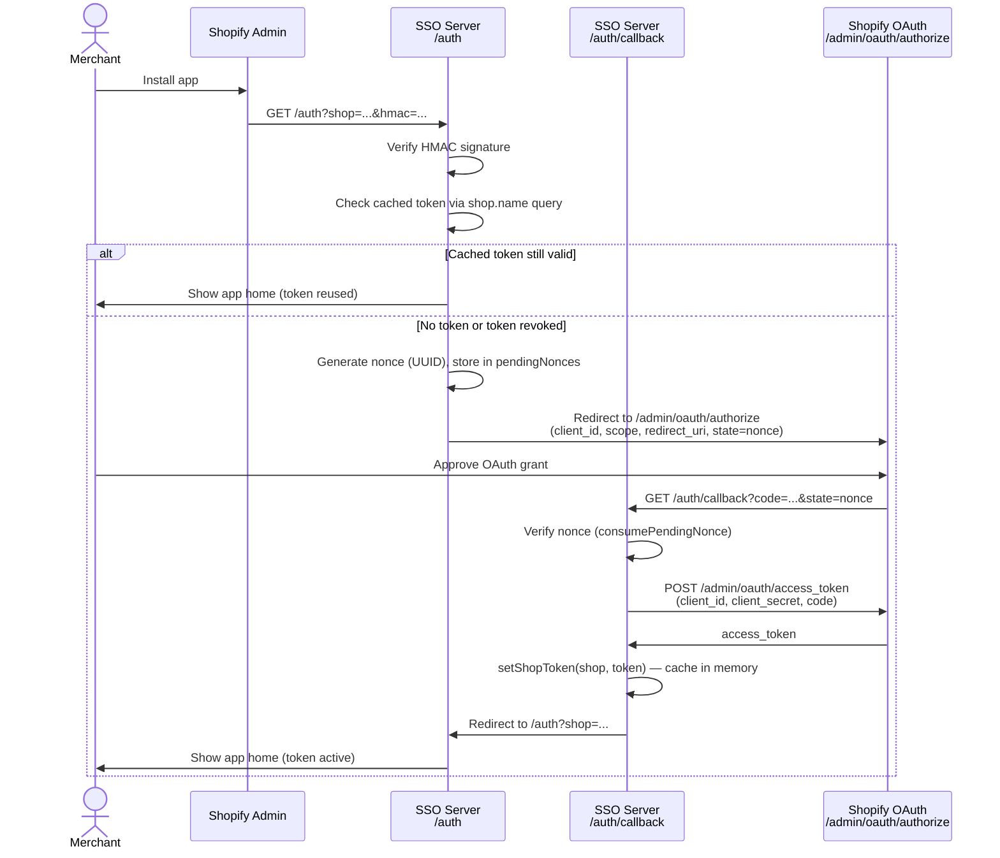
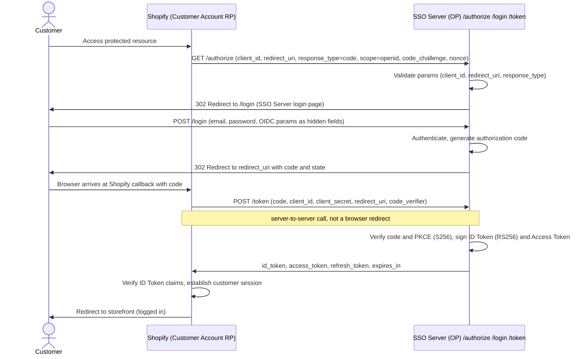
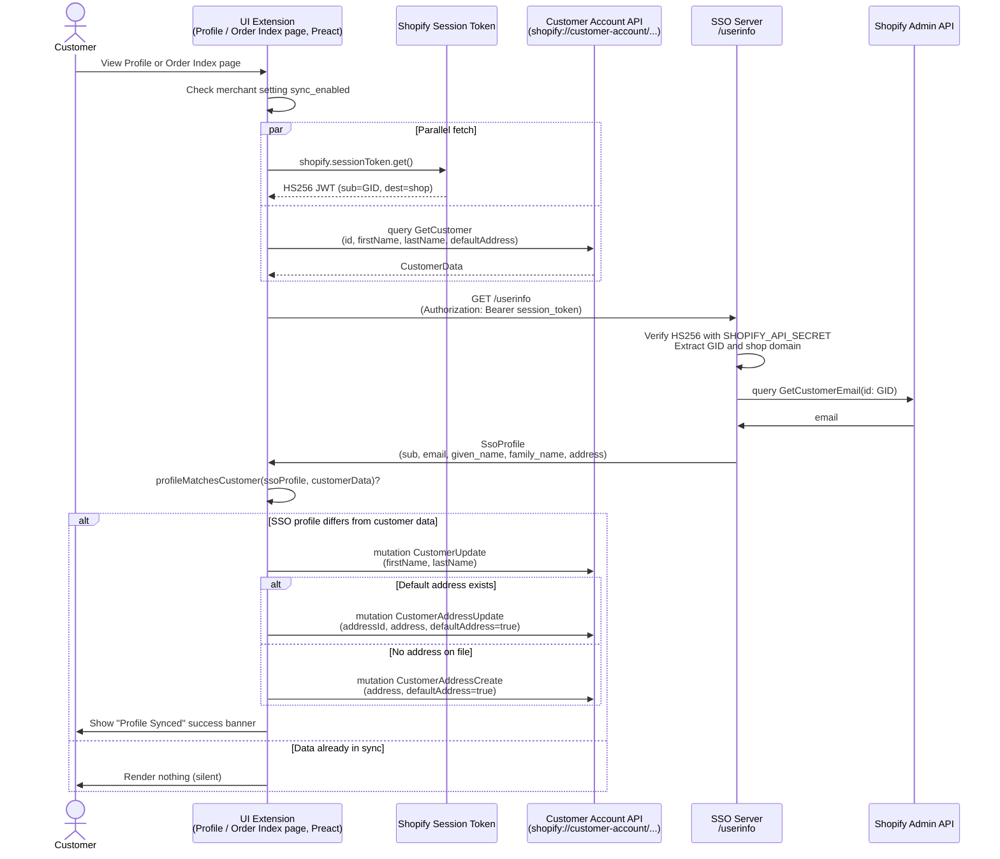
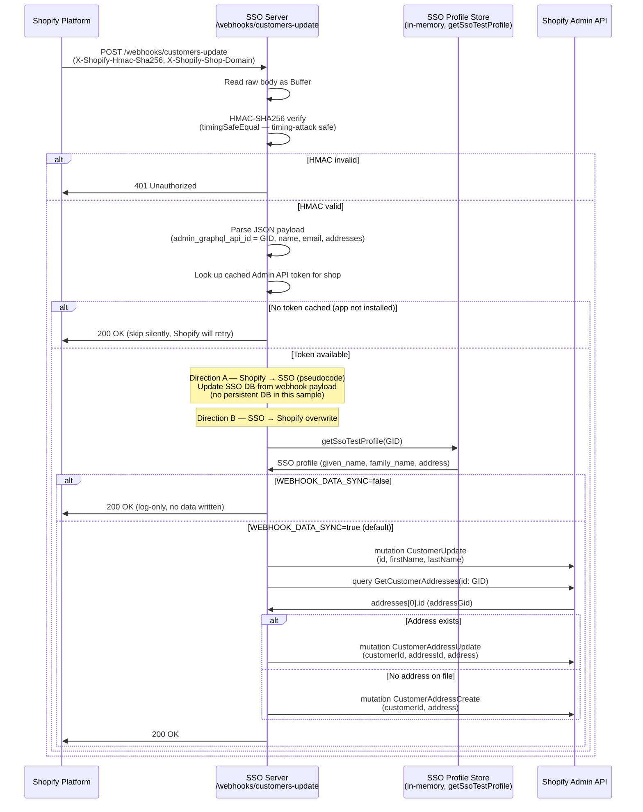
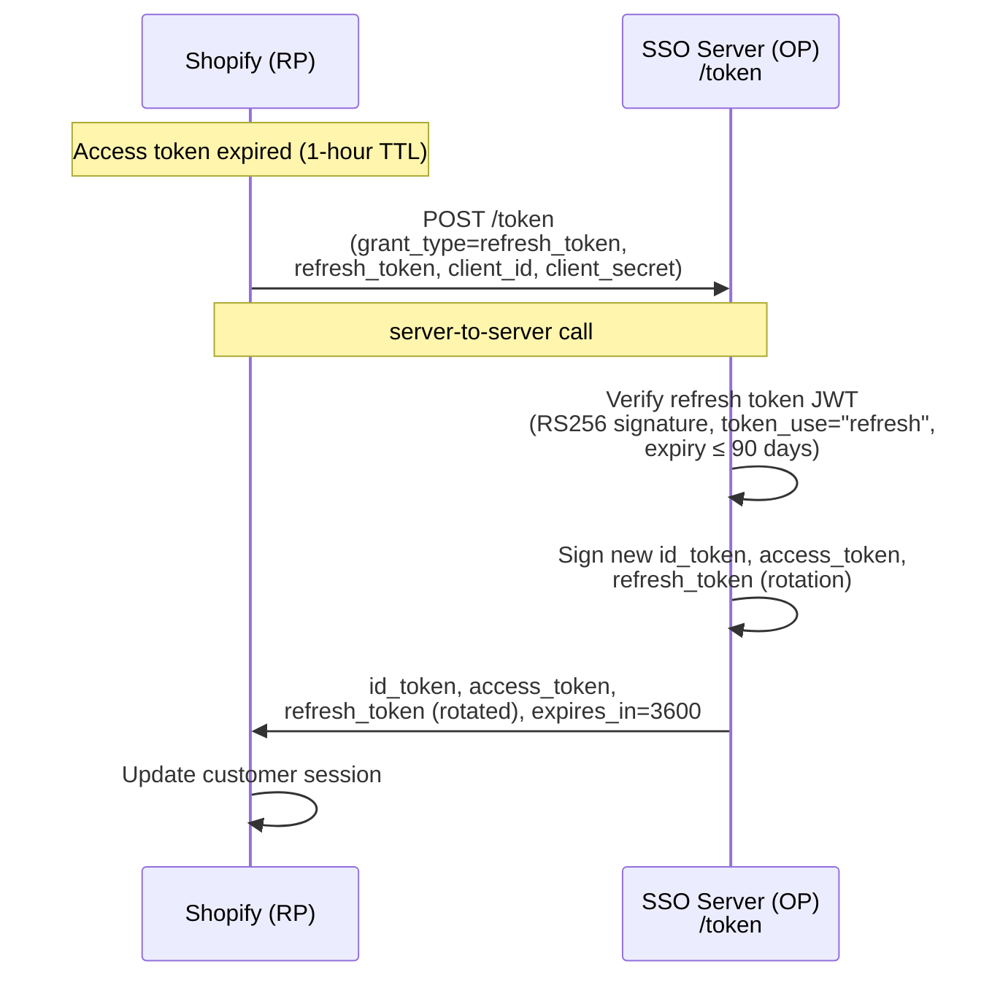
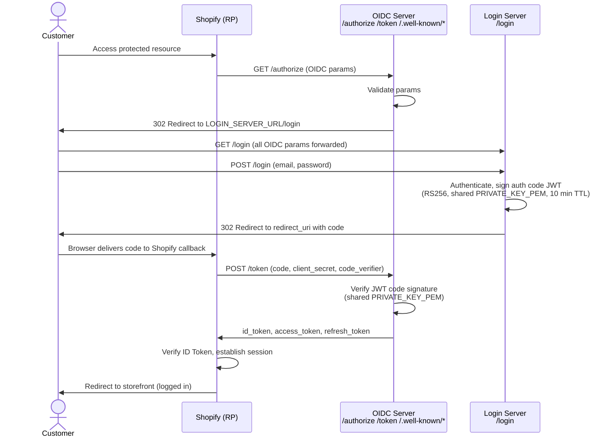

# Architecture — SSO Sample Sequence Diagrams

Four flows implemented in this sample.

---

## Flow 0 — App Installation OAuth (Admin API Token Acquisition)

The merchant installs the app via the Shopify Partner Dashboard or App Store. This flow obtains an Admin API access token and caches it server-side for subsequent Admin API calls.

**Key points:**
- HMAC on incoming request is verified with `SHOPIFY_API_SECRET` to confirm the request is from Shopify.
- Cached tokens are validated with a live `{ shop { name } }` Admin API query — a revoked token (after uninstall) triggers re-authorization automatically.
- The nonce is single-use and auto-expires after 10 minutes to prevent replay attacks.
- The access token is stored in-memory (`Map<shopDomain, token>`); it is lost on server restart and re-acquired on the next `/auth` visit.
- **This Admin API token is a prerequisite for Flow 2 and Flow 3.** Flow 2 (`/userinfo`) uses it to resolve a Customer GID to an email address via the Admin API. Flow 3 (webhook handler) uses it to overwrite customer data in Shopify. If the app has not been installed (no token cached), both flows degrade gracefully but cannot perform Admin API operations.

---

## Flow 1 — OIDC Authorization Code Flow (Login with profile sync)

Shopify Customer Account acts as the Relying Party (RP) and authenticates a customer via this SSO server acting as an OpenID Connect Provider (OP).

**Key points:**
- Shopify Customer Account is the OIDC Relying Party (RP); this SSO server is the OpenID Provider (OP).
- `/authorize` validates `client_id`, `redirect_uri`, and `response_type`, then redirects the browser to the SSO Server's own `/login` page — not to any Shopify endpoint.
- `/login` is the SSO Server's login UI. The customer enters credentials here, the server generates an authorization code, and redirects the browser back to Shopify's callback URL. An optional `sub` override field is available for testing — if provided, it is used directly as the `sub` value; otherwise `sub` is derived from the email address. The `sub` value is stored server-side with the authorization code, then embedded in the ID Token's `sub` claim when `/token` is called. It is never passed directly via URL or redirect — Shopify receives it only through the signed ID Token.
- `/token` is called **server-to-server** by Shopify's backend (not a browser redirect), per [RFC 6749 §4.1.3](https://datatracker.ietf.org/doc/html/rfc6749#section-4.1.3) and [OpenID Connect Core §3.1.3](https://openid.net/specs/openid-connect-core-1_0.html#TokenEndpoint). The user's browser waits at the callback URL while this exchange completes.
- **`/token` (and all IdP endpoints) must respond within 1 second.** Shopify will time out the request and fail the login flow if this is exceeded. Ensure the server is hosted in a low-latency environment. See [Shopify IdP Requirements](https://help.shopify.com/en/manual/customers/customer-accounts/sign-in-options/identity-provider/requirements).
- The ID Token returned by `/token` carries the customer profile as JWT claims. Shopify reads these claims to create or update the customer record at login time — **no separate `/userinfo` call is made during login**:

  | Claim | Description |
  |---|---|
  | `sub` | Customer identifier |
  | `email` | Email address |
  | `given_name` | First name |
  | `family_name` | Last name |
  | `urn:shopify:customer:addresses` | Address array (Shopify custom claim) |
  | `urn:shopify:customer:tags` | Customer tags — set to `"OIDC_SSO"` (Shopify custom claim). **All existing tags are replaced** when Overwrite is enabled. |

  See Flow 2 for `/userinfo` usage (UI Extension, post-login profile sync).

- **Shopify-side setting required for profile sync:** For Shopify to apply these claims and overwrite the customer record at login, the identity provider's **Sync customer data** setting must be enabled in Shopify Admin (Settings → Customer accounts → Authentication → Manage providers), and the overwrite rule must be set to **Overwrite existing customer data**. Without this setting, the claims are received but not applied. See [Sync customer data](https://help.shopify.com/en/manual/customers/customer-accounts/sign-in-options/identity-provider/sync-customer-data).
- **Refresh tokens are required to maintain the 90-day session.** See Flow 4 for the refresh token sequence and [Session and token requirements](https://help.shopify.com/en/manual/customers/customer-accounts/sign-in-options/identity-provider/requirements#session-and-token-requirements).

---

## Flow 2 — Customer Account UI Extension (userinfo → Customer Data Overwrite)

Runs on every page load (Profile page and Order Index page). Fetches the SSO profile and overwrites Shopify customer data if it differs.

**Key points:**
- Session token fetch and customer query run in parallel to minimize latency.
- `/userinfo` response embeds the Admin API query/response in `street_address` for demo visibility.
- All API calls are logged to browser DevTools console with URL, query, and response body.
- **CORS is required on `/userinfo`:** The UI Extension runs inside the customer's browser and calls `/userinfo` directly via `fetch()` with an `Authorization: Bearer <session_token>` header. This is a cross-origin request (from Shopify's customer account domain to the SSO server), so `/userinfo` must respond with `Access-Control-Allow-Origin: *`, `Access-Control-Allow-Methods: GET, POST, OPTIONS`, and `Access-Control-Allow-Headers: Authorization, Content-Type`, and handle `OPTIONS` preflight requests. Other endpoints that are only called server-to-server (e.g. `/token`, webhook handler) or via browser redirect (e.g. `/authorize`, `/login`, `/logout`) do not require full CORS support.
- **Why the Admin API is required to resolve the customer email:** The UI Extension calls `/userinfo` with the Shopify session token as a Bearer token. The session token's `sub` claim is the **Shopify Customer GID** (`gid://shopify/Customer/123`) — not the OIDC `sub` from Flow 1. To return the SSO profile, `/userinfo` must map this GID to an email address. All alternative approaches are blocked:
  - **Flow 1 `sub` → GID mapping:** The GID is not known at login time (Shopify assigns it independently), so a reverse-mapping table cannot be built.
  - **Session token email claim:** The session token contains only `sub` (GID), `dest`, `aud`, `exp`, `nbf`, `iat`, and `jti` — no email.
  - **Storefront API / Customer Account API:** These APIs only expose data for the currently authenticated customer and do not support lookup by GID from a server context.
  - **Admin API:** Supports `customer(id: GID)` queries from a server with an Admin API token, making it the only viable option to resolve GID → email.

---

## Flow 3 — Webhook (Shopify customers/update → SSO → Shopify Overwrite)

Triggered by Shopify when any customer record is updated. The SSO server overwrites Shopify with the canonical SSO profile (Direction B).

**Key points:**
- Raw body is read as `Buffer` before JSON parsing to compute the correct HMAC.
- `WEBHOOK_DATA_SYNC=false` disables Direction B data writes (log-only mode). Default (unset) is `true`.
- Direction A (Shopify → SSO DB) is shown as pseudocode — no persistent DB in this sample.
- Direction B (SSO → Shopify) mirrors what the UI Extension does, but server-side.
- Non-2xx responses trigger automatic Shopify webhook retry.
- `X-Shopify-Hmac-Sha256` is verified with `timingSafeEqual` to prevent timing attacks.

---

## Flow 4 — Refresh Token Grant (Session Renewal)

Triggered by Shopify each time the access token expires (TTL: 1 hour). Extends the customer session up to 90 days without requiring the customer to log in again.

**Key points:**
- Called **server-to-server** by Shopify when the access token expires. The customer's browser is not involved.
- The refresh token is a **self-contained RS256 JWT** with a 90-day TTL. The OP verifies it cryptographically — no database lookup needed.
- **Token rotation**: every call issues a fresh refresh token. The previous refresh token is not reusable (it will fail JWT expiry/replay checks on subsequent calls).
- `expires_in: 3600` in the response signals Shopify how often to call this endpoint (every hour).
- If the refresh token is expired or the signature is invalid, the OP returns `invalid_grant` and Shopify terminates the customer session.
- See [Session and token requirements](https://help.shopify.com/en/manual/customers/customer-accounts/sign-in-options/identity-provider/requirements#session-and-token-requirements) for Shopify's expectations.

---

## Split-Server Deployment (Optional)

The default setup runs all endpoints on one server. When `LOGIN_SERVER_URL` is set, `/authorize` redirects the browser to the login UI on a separate server.

**Key points:**
- `LOGIN_SERVER_URL` controls the redirect target in `/authorize`. If unset (default), `/login` on the same server is used — no behavior change.
- Both servers must share the same RSA key pair via `PRIVATE_KEY_PEM`. If unset, each server auto-generates its own key at startup (single-server only).
- The authorization code is a **self-contained RS256 JWT** — the OIDC server verifies it cryptographically without a shared database or inter-server call.
- **In production, the OIDC server must access user profile data from the Login server.** When `/token` or `/userinfo` needs to return the user's profile (name, address, etc.), the OIDC server has no local copy of that data — it lives on the Login server. Access it via a direct database connection shared between both servers, or an internal API endpoint on the Login server. In this sample, `getShopifyClaimsProfile()` and `getSsoTestProfile()` return hardcoded test data and serve as the placeholder for this integration point.
- See [README — Split-Server Deployment](README.md#split-server-deployment-optional) for step-by-step setup instructions.
